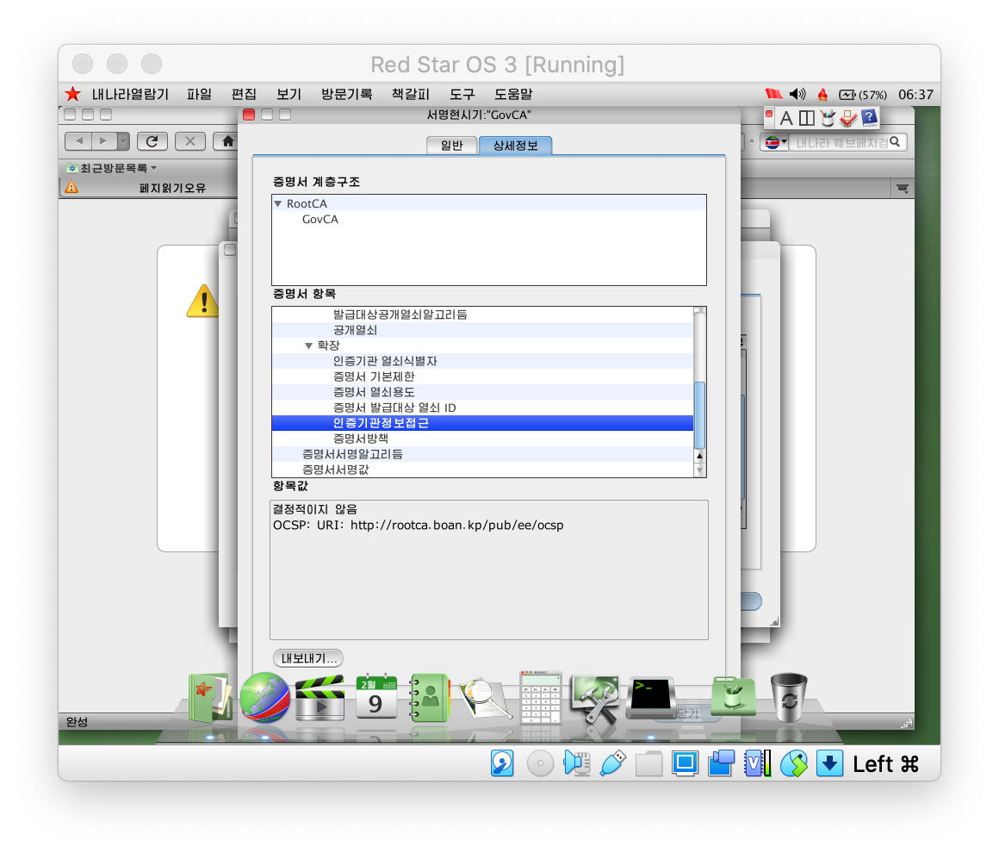
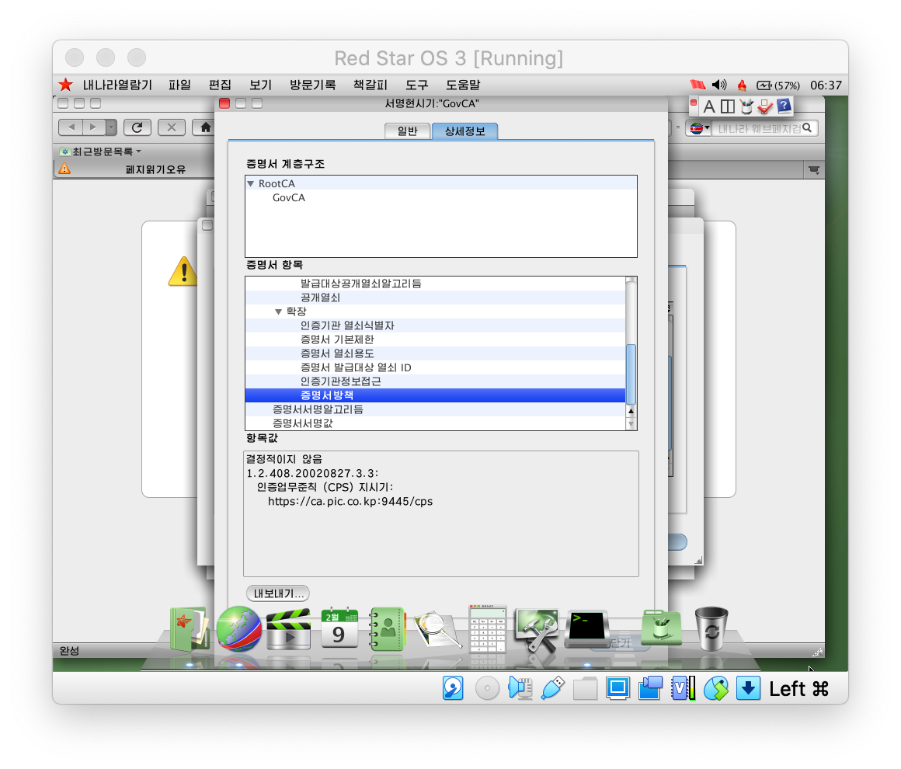

# North Korean Root Certificates

## About

This repository contains the Root CA certificates in trust stores of computers used in the North Korean state (the DPRK).

These certificates are sourced from the Naenara browser running on Red Star OS 3.0 (from circa 2015). Some of these certificates have expired and it is known there are other certificates in North Korea's Public Key Infrastructure that are not present here.

## Contact

The easiest way to get in touch with me is on Twitter @[IcyApril](https://twitter.com/IcyApril).

## Screenshots

